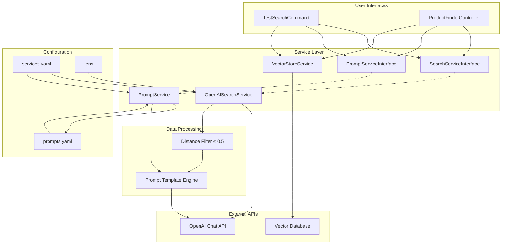

# Product Finder with GenAI and Symfony

This Symfony application enables the import of XML product data, the vectorization of products, and synchronization with Milvus (a vector database). End users can find products that meet their needs through a natural language interface.

## Features

- Import of electronic products from XML files
- Vectorization of all product properties with OpenAI Embeddings
- Individual storage of product features and specifications in the vector database
- Storage and search in the Milvus vector database
- Natural language product search via API
- Web interface with DeepChat for end users
- Flexible configuration for API keys and endpoints

## Technical Architecture

The application consists of the following main components:

1. **XML Import**: Reads product data from XML files and converts them into Product objects
2. **Embedding Generator**: Creates vector representations for products, product features, specifications, and search queries
3. **Milvus Integration**: Stores and searches product vectors, feature vectors, and specification vectors in the vector database
4. **API Controller**: Provides REST endpoints for product search
5. **Web Interface**: Offers a user-friendly interface for end users

The core of the application is built upon the following key libraries and technologies:

- **Symfony Framework**: Provides the foundational structure for the application.
- **`helgesverre/milvus`**: Used for all interactions with the Milvus vector database, including storing and querying product vectors.
- **`openai-php/client`**: Enables the generation of text embeddings for products and search queries via the OpenAI API.

## System Architecture and Search Flow Sequence

### System Architecture Components

The application follows a service-oriented architecture with the following key components:

1. **Controllers**:
   - `ProductFinderController`: Handles API endpoints for product search, including basic search and chat-based search
   - `WebInterfaceController`: Manages the web interface for end users

2. **Services**:
   - `XmlImportService`: Parses XML files and extracts product data
   - `OpenAIEmbeddingGenerator`: Generates vector embeddings for products and search queries using OpenAI's API
   - `MilvusVectorStoreService`: Manages interactions with the Milvus vector database for storing and searching product vectors
   - `OpenAISearchService`: Generates natural language recommendations based on search results using OpenAI's chat models
   - `PromptService`: Manages prompts for the OpenAI chat models

3. **Entities**:
   - `Product`: Represents a product with its properties, features, specifications, and vector embeddings



### Search Flow Sequence

The search process follows this sequence:

1. **User Query Input**:
   - User enters a natural language query through the web interface or API
   - The query is sent to the `ProductFinderController`

2. **Query Processing**:
   - For chat-based search, the controller extracts the search intent from the user's message
   - The query is passed to the `OpenAIEmbeddingGenerator` to create a vector representation

3. **Vector Database Search**:
   - The query embedding is sent to the `MilvusVectorStoreService`
   - Milvus performs a similarity search using cosine similarity
   - The service returns the most similar products (up to the specified limit)

4. **Result Filtering**:
   - Results are filtered based on a relevance threshold (distance <= 0.5)
   - Products that don't meet the threshold are excluded

5. **Response Generation** (for chat-based search):
   - The filtered results are passed to the `OpenAISearchService`
   - A system prompt and user message are created with the query and product list
   - OpenAI's chat model generates a natural language recommendation
   - The controller returns both the recommendation and the product list

6. **Response Presentation**:
   - The web interface displays the results to the user
   - For API requests, the results are returned as JSON

This architecture enables semantic search capabilities where users can find products based on natural language descriptions of their needs, rather than exact keyword matching.

```mermaid
sequenceDiagram
participant U as User
participant C as Controller/Command
participant VS as VectorStoreService
participant F as Distance Filter
participant PS as PromptService
participant OSS as OpenAISearchService
participant API as OpenAI API

    U->>C: Search Query
    C->>VS: findSimilar(query, limit=3)
    VS-->>C: Raw Results
    
    C->>F: Filter by distance ≤ 0.5
    F-->>C: Filtered Results
    
    alt No Results After Filter
        C-->>U: "No relevant products found"
    else Results Found
        C->>PS: getPrompt('system_prompt')
        PS-->>C: System Prompt
        
        C->>PS: getPrompt('user_message_template', params)
        PS-->>C: User Message with Products
        
        C->>OSS: generateChatCompletion(messages)
        OSS->>API: Chat Completion Request
        API-->>OSS: AI Response
        OSS-->>C: Recommendation Text
        
        C-->>U: Products Table + AI Recommendation
    end
````

## Installation

### Prerequisites

- PHP 8.1 or higher
- Composer
- Symfony CLI (optional, for local development)

### Setup

1. Clone the repository:
   ```
   git clone [repository-url]
   cd symfony-product-finder
   ```

2. Install the dependencies:
   ```
   ddev composer install
   ```

3. Configure the environment variables in a `.env.local` file:
   ```
   OPENAI_API_KEY=your_openai_api_key
   OPENAI_EMBEDDING_MODEL=text-embedding-3-small
   OPENAI_CHAT_MODEL=gpt-3.5-turbo
   MILVUS_API_KEY=your_milvus_api_key
   MILVUS_HOST=your_milvus_endpoint
   MILVUS_PORT=443
   MILVUS_COLLECTION=products
   ```

4. Start the Symfony server:
   ```
   ddev start
   ```

### Development with Gitpod

This project can be opened and used directly in Gitpod, an online IDE for GitHub.

[](https://gitpod.io/#https://github.com/iGore/symfony-product-finder)

Gitpod automatically starts a fully functional development environment, including DDEV integration. After starting the workspace, DDEV is automatically started, and the application is accessible via the URL provided by Gitpod. The necessary ports (e.g., for the web server and Mailpit) are automatically opened.

You can use DDEV commands in the Gitpod terminal as usual (e.g., `ddev ssh`, `ddev logs`).

## Usage

### Importing Products

Use the following command to import products from an XML file:

```
ddev php bin/console app:import-products src/DataFixtures/xml/sample_products.xml
```

During import, not only the products as a whole but also their individual features and specifications are stored as separate vectors in the database. This enables more precise search results and better matching of user queries to specific product properties.

The API keys are optional. If not provided, the application uses mock data for testing.

### Testing Product Search

Test the product search with the following command:

```
ddev php bin/console app:test-search "I'm looking for a waterproof smartphone with a good camera"
```

### Web Interface

Open the application in your browser at `https://symfony-product-finder.ddev.site/` and use the chat interface to find products.

## Customization

### Custom XML Structure

You can adapt the XML import logic in `src/Service/XmlImportService.php` to support your own XML structure.

### Other Embedding Providers

The application uses OpenAI for embeddings by default but can be easily switched to other providers. To do this, implement the `EmbeddingGeneratorInterface`. If you want to use another provider, you also need to implement the methods `generateFeatureEmbeddings` and `generateSpecificationEmbeddings` to create embeddings for individual product features and specifications.

### Milvus Configuration

The Milvus integration can be customized in `src/Service/MilvusVectorStoreService.php` to meet specific requirements. You can adapt the methods `insertProductFeatures` and `insertProductSpecifications` to change how product features and specifications are stored in the vector database.

## Development

### Running Tests

```
ddev php bin/phpunit
```

### Adding New Features

1. Create new controllers in `src/Controller/`
2. Add new services in `src/Service/`
3. Extend the entities in `src/Entity/`

## License

This project is licensed under the MIT License.
